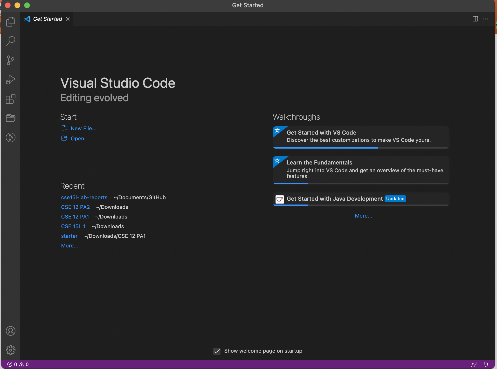
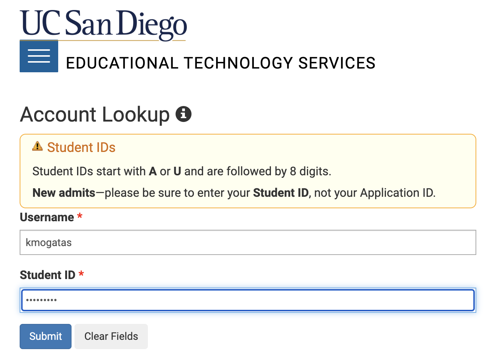
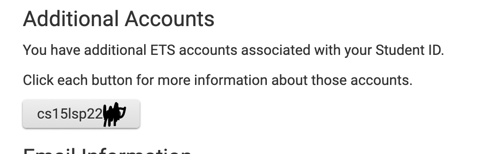
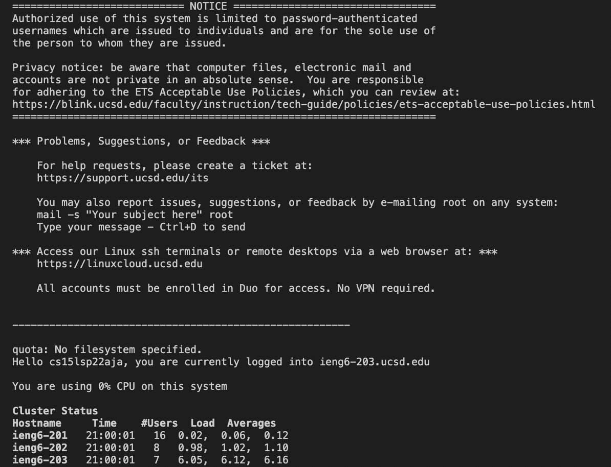
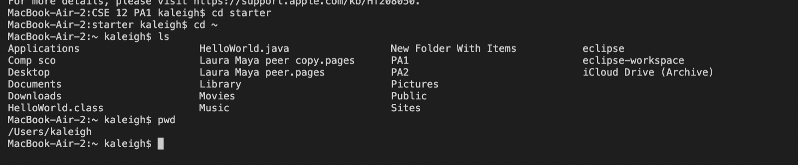
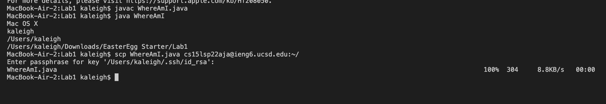
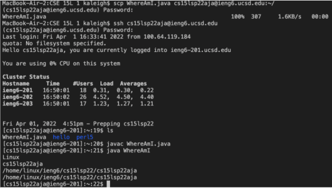
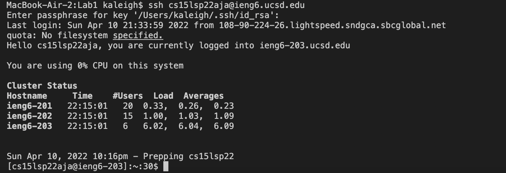
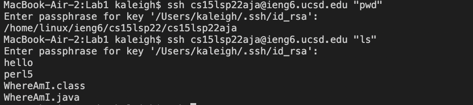
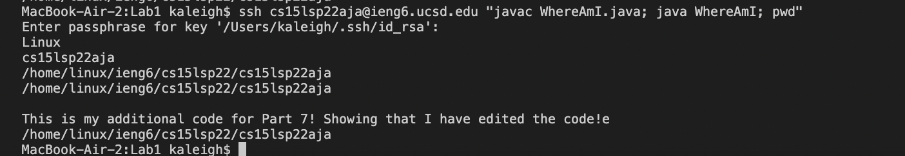

# Week 2 Lab Report 1

```
By Kaleigh Mogatas 
ID: 17051705
```
---
**Lab Report Summary**:
You will be learning how you will access our course specific account, remotely, using the `ieng6` server.

**Sources Used:** [Lab 1 Instruction Document](https://docs.google.com/document/d/1AO6RDoJnaWxMui-UFjEa_2bbQ4qcANpbIpPuV-awsOg/edit)

---
>## ***Part 1:** Installing VScode*

We must install a program in order to run and create our code!

**Step 1**: You must download and install VScode at [https://code.visualstudio.com/](https://code.visualstudio.com/). However, since there are different operating systems, you must make sure that you are downloading the correct one that will work best for your system.

Once VScode is installed, when you open it, you should see a window that is similar to this: 


---
>## **Part 2:** Remotely connecting ##

In this step we will be learning how to access your remote server from your client! This will help you manage your code from different devices so you can do your work on the computers within the CSE building!

*Note: For this step, if you have a **Windows** operating system, you will need to install an additional program called **OpenSSH** in order to connect to other computers.*

*Use this [link](https://docs.microsoft.com/en-us/windows-server/administration/openssh/openssh_install_firstuse) to do so.*

**Step 1:** In this step, you must first look up your course-specific account (which is CSE 15L). Then change your TritonLink password.

* The username would be your UCSD sign-in username.
* The student ID section should be your account SSID (either starting with A or U - example: AXXXXXXXX). 


**Step 2:** In VScode, create a new file named `WhereAmI.java` and type in the following code:

```
class WhereAmI {
  public static void main(String[] args) {
    System.out.println(System.getProperty("os.name"));
    System.out.println(System.getProperty("user.name"));
    System.out.println(System.getProperty("user.home"));
    System.out.println(System.getProperty("user.dir"));
  }
}
```

**Step 3:** Now, we will be connecting to the remove computer using the terminal in VScode (Terminal → New Terminal menu option).
* In the command line, type `ssh` in the username provided to you during the Account LookUp that you did in the last previous steps that is followed by `@ieng6.ucsd.edu`. 
* ssh < account-cse15L-username > @ieng6.ucsd.edu

* Then you will be provided to type in your password. Once you have connected you should see the following message:



Now you are personal computer is connected to the server as it is remotely connected to the CSE computers in the basement. 

---
>## **Part 3:** Trying Some Commands


Within this step, you will be trying some commands within the server terminal or on your client terminal.

*If you would like to exit the remote server use `Ctrl-D` or type `exit` within the terminal*
* `ls` : this lists all the files within the directory that you are in 
* `cd` : this changes the directory that you are in
* `cd ~` : this changes your directory to the home directory
* `mkdir [name]` : creates a new directory with the designed name
* `pwd` : this prints the current directory that you are working in



---
>## **Part 4:** Moving Files over SSH with `scp`

In this step, we will learn how to transfer and update our code from our client to the remote server. This will allow us to copy our files between our client and remote server to make sure that the code gets updated!

**Step 1:** Within the terminal of your `WhereAmI.java` file, type in:
* `javac WhereAmI.java`
* `java WhereAmI`

**Step 2:** Within the same terminal, copy this command and run it (however, you must make sure that you are using your correct username):

* `scp WhereAmI.java cs15lsp22zzz@ieng6.ucsd.edu:~/`
* You will be prompted to type in a password or a passphrase (only if you have created one already). This is similar to where you are trying to log into your `ssh`



**Step 3:** Now, when you log into your `ssh` again within the terminal and `javac WhereAmI.java` and `java WhereAmI` it would be able to run.
* It should look like something like this within the terminal: 


---
>## **Part 5:** Setting an SSH Key

Within this step, you will be creating a *key* to log into your `ssh` faster, to avoid all the repetitiveness of typing in your long password. This is due to the fact that we must continually `ssh` and `scp` to copy files to the remote server. 

By creating this *key* it will be faster to obtain access of your remote server.

**Step 1:** On your terminal (make sure that you are not in the remote server - type "exit" if so), you should type in "`ssh-keygen`"

* Once you run that command, you should see the following message:

```
Generating public/private rsa key pair.
Enter file in which to save the key (/Users/<user-name>/.ssh/id_rsa): /Users/<user-name>/.ssh/id_rsa
Enter passphrase (empty for no passphrase):
```

* Now as you type in a key, it will ask you to type the phrase in again and you will see the terminal say something around the lines of (with a random art image): 

```
Your identification has been saved in /Users/<user-name>/.ssh/id_rsa.
Your public key has been saved in /Users/<user-name>/.ssh/id_rsa.pub.
The key fingerprint is:
SHA256:jZaZH6fI8E2I1D35hnvGeBePQ4ELOf2Ge+G0XknoXp0 <user-name>@<system>.local
```
*Note: Within this step, a private (`id_rsa`) and public (`id_rsa.pub`) key will be created.*

**Step 2:** We now need to copy the public key into your `.ssh` directory to create the key.
* In the terminal, sign into your `ssh` account (just like we have in the previous steps)
* Enter your password  
* Then run the command `mkdir .ssh` and log out (type "exit" and run in the terminal)

**Step 3:** Now you are back onto your clients server (not your remote server). Within the terminal type in: 

`scp /Users/<user-name>/.ssh/id_rsa.pub cs15lsp22zz@ieng6.ucsd.edu:~/.ssh/authorized_keys` 
- **make sure to fill in your correct usernames in the correct places**


Once you have followed these steps, you should be able to go onto ssh and run scp from your personal client and get onto the server without having to type in a long and repetitive password! Now you just have to use a key (or not if you left the phrase empty)!

When you try logging into ssh or running scp, it should look something like: 


Notice how it asks for a "passphrase" instead of a password!!

---
>## **Part 6:** Optimizing Remote Running

In this step, you will learn ways to make it easier to process local edits from your files to the server.

**Step 1:** On your client, try making edits on the file that you would want to save to your remote server. 
* Then run `scp` command like in **Part 4** to update the changes from your client to your server.

**Step 2:** Within your terminal, you are able to use quotations to directly correlate your commands to the remote server as long as you have `ssh` at the beginning. Some examples could be:
* `ssh cs15lsp22zz@ieng6.ucsd.edu "ls"` : this will log you into your servier and list all the directories within your server
* `ssh cs15lsp22zz@ieng6.ucsd.edu "pwd"` : this command will print the current directory that you are working in within the server 
* This may look something like this: 


**Step 3:** LASTLY, you are also able to run multiple commands within a single line of code. However, you need to be using a semicolons between each of the different commands! 
* For example, I am able to compile my code, run my code, and also print my current working directory in one line from my server using `ssh`.


Another useful function would be using the **up-arrow** that will call your most command. This will efficiently help you run and test your code, instead of writing out the entire command every single time!

By being able to do this, we will be able to easily run and test our code from our client to our remote server faster and more efficiently!

---

Hopefully this was helpful in helping you understand how to log into a course-specific account using `ieng6`!


