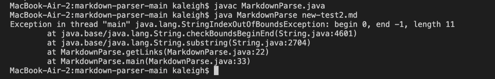

# Lab Report 2

```
By Kaleigh Mogatas 
ID: A17051705
```

>## **Error 1** 

The first error encountered was within the failure-inducing input of [`test-file.md`](https://raw.githubusercontent.com/Sking56/markdown-parser/ee4f5e52e3371bffd4c01c796502c5bd97b3deb2/test-file.md). This file contained an empty line at the end of the document, which created an infinite loop as a symptom.


This error messages shows that it has created an infinite loop. I know this because when I added a print statement within the while loop, it infinitely ran that print statement, as shown below:


In order to fix this error, my lab group created a change within our code to check whether the element found at that empty line is an open bracket or not in order to break the infinite loop. This change is shown below: 


As the failure-inducing input, `test-file.md`, was being ran, there was a bug in the code that caused a symptom of an infinite loop. Due to the fact that there was a empty line at the end of the `test-file.md`, our code did not account for it. This means that the bug within the code was that it did not account for characters that was not included in creating a link. The code only accounted for `[`, `]`, `(`, and `)` characters. So as it moved onto the next line, it was continuously looking for an open bracket `[` because the last element they found was a closed parenthesis, so they must look for another open bracket to find another link. However, the open bracket was not there, leading to the symptom of having an infinite loop. So by checking if the index of the `openBracket` is -1 allows us to break out of the infinite loop, which fixes our bug and gets rid of our symptom for our failure-inducing input.

___

>## **Error 2** 

The second error encountered was within the failure-inducing input of [`new-test2.md`](https://raw.githubusercontent.com/Sking56/markdown-parser/main/new-test2.md). This file did not contain an open,`(`, and closed, `)`, parenthesis after the open, `[`, and closed, `]`, brackets, so as the code was searching for the elements, it returned the index of `openParen` as -1. This index of -1 thus caused an `IndexOutOfBounds` error as the symptom, shown below:




In order to avoid this symptom, we created the following code changes:


This code change checked that if the index of `openParen` is -1, then it will break out of the loop. 

As the failure-inducing input `new-test2.md` was being parsed through, there was another symptom that occured because there was a bug in our code. As the code was being ran, `openParen` and `closeParen`'s index are -1, so as it continued to the next line of code  `toReturn.add(markdown.substring(openParen + 1, closeParen))` (Line 22), a symptom had occurred. This means that the bug in our code was that we did not account for our text files only having brackets, with no parenthesis. Additionally, this means that our bug is that it did not account for our inputs not being followed by a link. So since we did not have open and close parenthesis, it made their index equal to -1. As line 22 tried to be ran, it caused an error because having an index of -1 is not valid, thus causing the symptom of having an `IndexOutOfBounds`. So, with our code change, it allows us to fix our bug and make sure that if it is not followed by an open parenthesis, it will break out of the while loop, causing it to fix our symptom of `IndexOutOfBounds`. This allows us to properly run our failure-inducing input without any bugs and symptoms following.

___

>## **Error 3** 

The third error encountered was within the failure-inducing input of [`new-test3.md`](https://raw.githubusercontent.com/Sking56/markdown-parser/main/new-test3.md). This file did not contain a closed bracket `]`, however it did have `[`, `(`, and `)`. 


This is an incorrect output because what it printed is incorrect. The correct output shoudl have been an empty list, "`[]`".

In order to avoid this error, my group did the following code changes:


Within this code change, we made sure that it accounted to make sure that all the values used within creating a list is being taken into consideration. So if any of the elements are missing, then it should print out an empty list.

As the failure-inducing input, `new-test3.md`, was being ran through the terminal, it had printed out the wrong output. Since the symptom is that the program printed out the wrong output, that means that there is a bug within the program. The bug is that our code did not account for missing close brackets, `]`, and close parenthesis, `)`. Additionally, our bug in our code is that it does not account for missing elements needed to create a link. Since we did not account for this missing character in our code, it continued to printing out the text that is inside the parenthesis, in this case being `"Something"`. This means that our code neglected the missing element, even when it should have, by continuing to the next line of code `toReturn.add(markdown.substring(openParen + 1, closeParen))` (Line 22). Since it continued to Line 22, it added the elements between the parenthesis to the list to get printed, thus creating the symptom of printing out the incorrect output. So, within `new-test3.md`, it did not have the close brackets, however, it still printed out the element that was inside the parenthesis, even when it should not have. By adding our code changes, our failure-inducing input is able to be read properly since we have gotten rid of the bug in our code. Since we have gotten rid of the bug in our code, that means that there will no longer be a symptom when running our program. This code change makes sure that all of the elements for creating a link are present in order to print out the proper links within the input.
