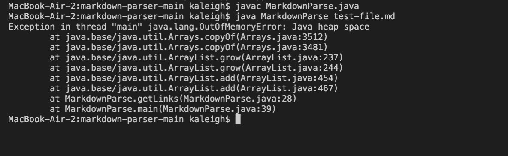
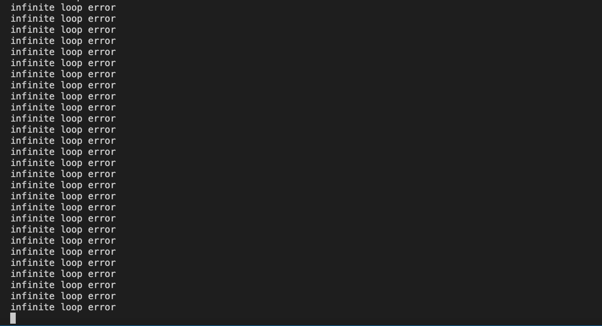
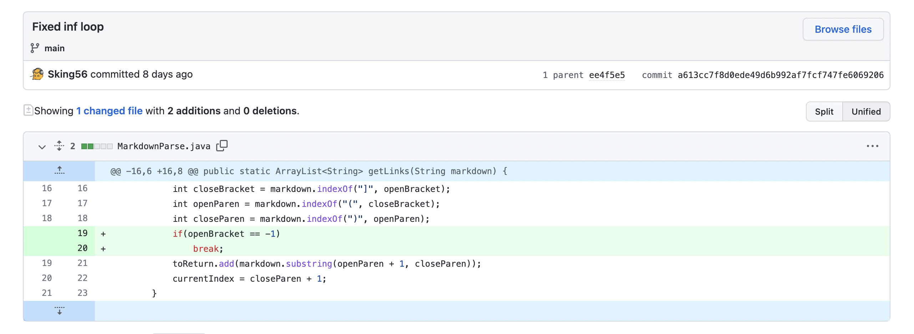
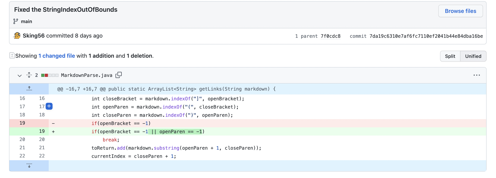
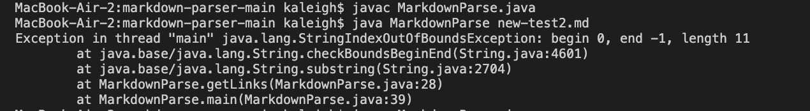
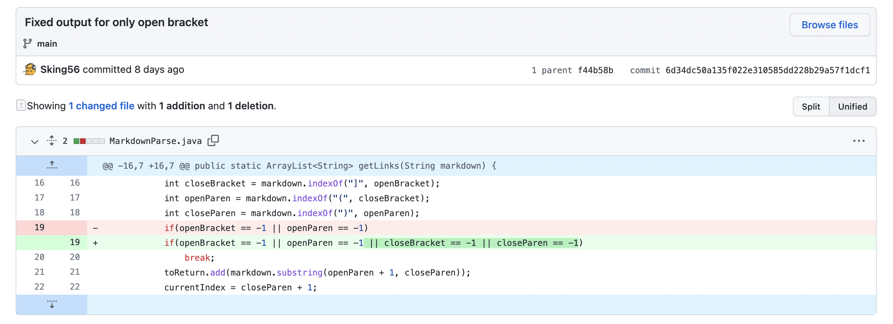
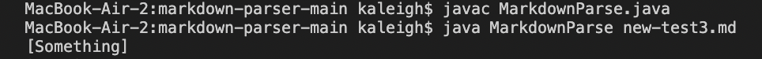

# Lab Report 2

```
By Kaleigh Mogatas 
ID: A17051705
```

>## **Error 1** 

The first error encountered was within the failure-inducing input of [`test-file.md`](https://raw.githubusercontent.com/Sking56/markdown-parser/ee4f5e52e3371bffd4c01c796502c5bd97b3deb2/test-file.md). This file contained an empty line at the end of the document, which created an infinite loop as a symptom.



This error messages shows that it has created an infinite loop. I know this because when I added a print statement within the while loop, it infinitely ran that print statement, as shown below:



In order to fix this error, my lab group created a change within our code to check whether the element found at that empty line is an open bracket or not in order to break the infinite loop. This change is shown below: 




>## **Error 2** 

The second error encountered was within the failure-inducing input of [`new-test2.md`](https://raw.githubusercontent.com/Sking56/markdown-parser/main/new-test2.md). This file did not contain an open and closed parenthesis, so as the code was searching for the elements, it returned the index of `openParen` 



LINK



>## **Error 3** 



LINK



