# Lab Report 3

```
By Kaleigh Ross Mogatas 
ID: A17051705
```

>## **Streamlining ssh Configuration** 

I went into my `nano`, to create my `ssh config` file. This was where I was able to edit and place my key. As seen below, it shows what I have printed and edited within my `config` file:
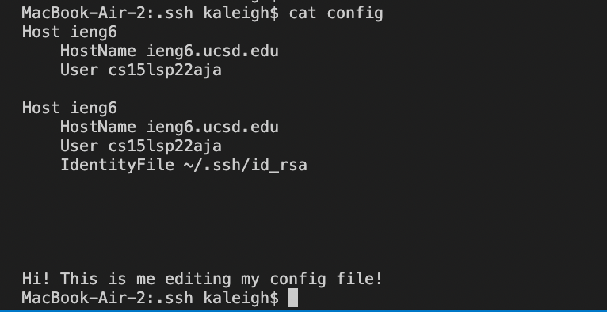

Now, I am able to log into my `ssh` account without needed to type in my entire email due to my edits that I created in my `config` file. This is seen below as I only used `ssh ieng6` in order to log into my remote server:

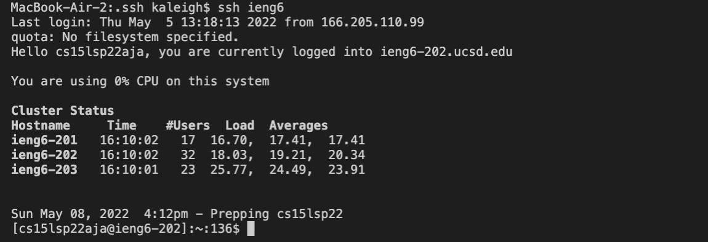

With this in mind, since I do not have to type in my entire email and password, it will now be faster to `scp` into my remote server computer. As seen below, you see me creating a new file, and `scp`'ing it into my remote server. Then you are able to see it placed into my remote server:

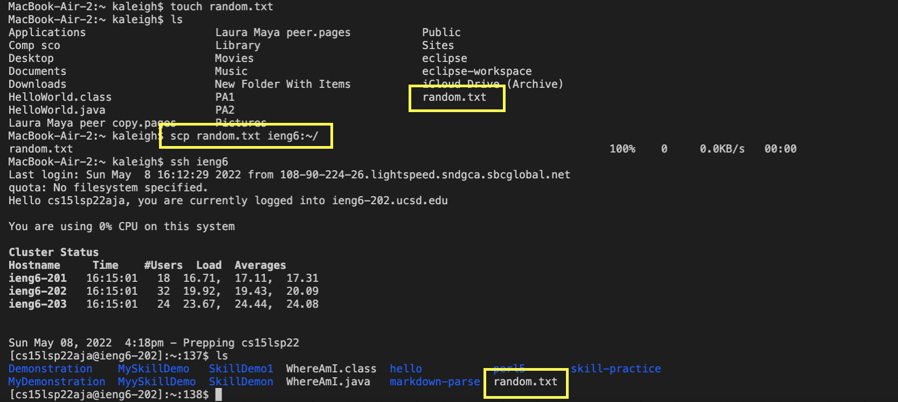


>## **Setup GitHub Access from ieng6** 

When going into `GitHub`'s settings, and go into the tab for `SSH and GPG keys`, you will see all of your `ssh` keys that you have created. Shown below is where my public key is that I have created, where it is stored within GitHub.
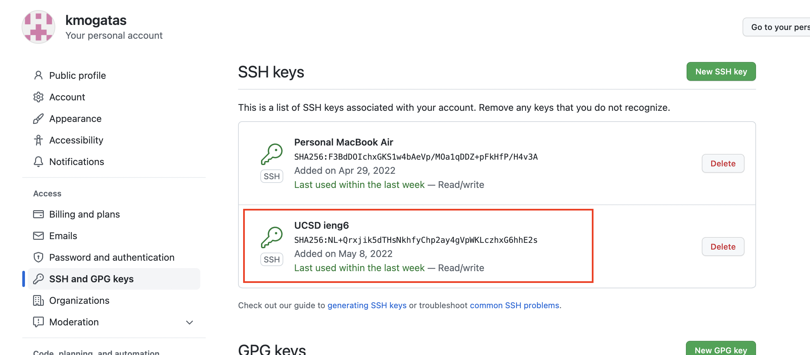

Below shows the private key, `id_ed25519`, that I made and is stored within my user account of my laptop:
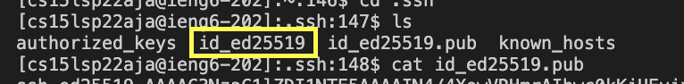

Below shows the public key, `id_ed25519.pub`, that is stored within my user account. This key is what is placed within my GitHub account in order to quickly access my ieng to easily use `git` commands:
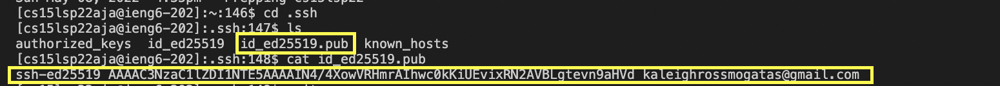

An important detail in this photo is that, you can see that I am logged into my `ieng6` account by seeing `cs15lsp22aja@ieng6.ucsd.edu` within my terminal. Within this image, I had created a new text file called `new-test.txt`, where this file will be committed and pushed using `git` commands. As you can see, I used `git add`, `git commit -m`, and `git push` to be able to update my GitHub repository by adding this `new-test.txt` into my repo:
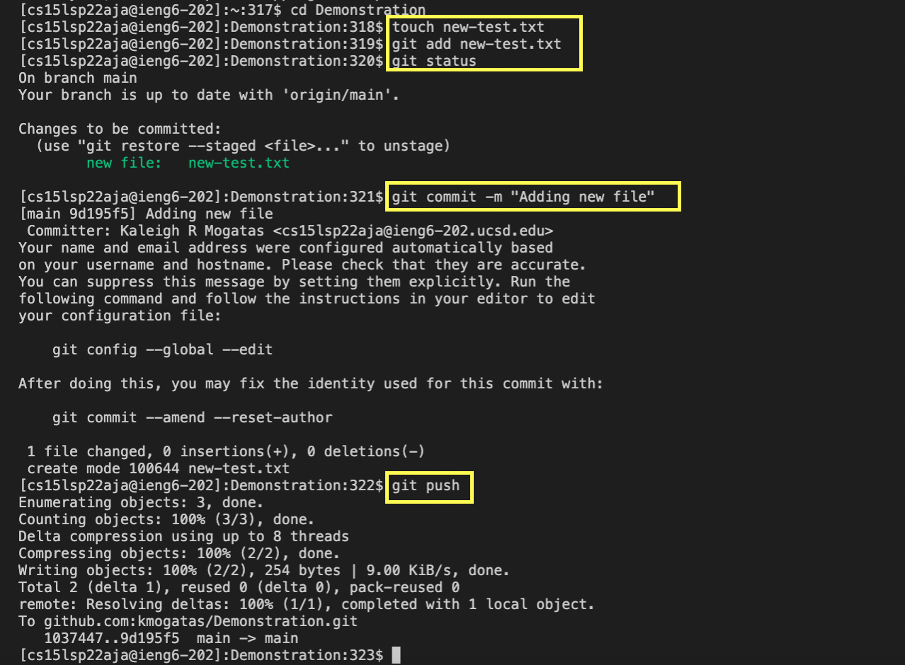

This photo shows the new commit that I have created into my Demonstration repository, where I committed and pushed the `new-test.txt`.

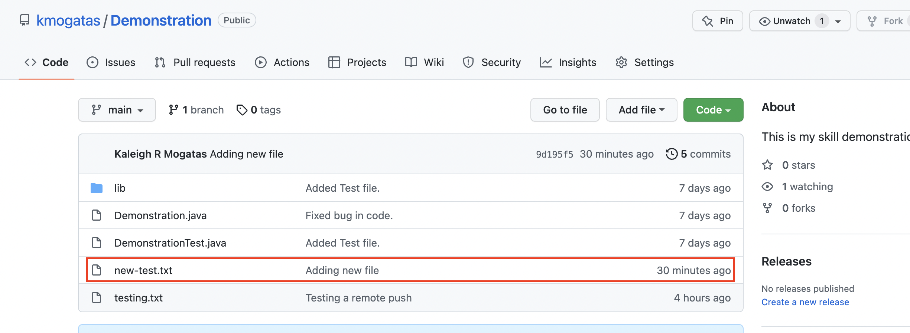

[This is the link for my resulting commit!](https://github.com/kmogatas/Demonstration/commit/9d195f5034f3c3a6461acdd45b4d1206dc702cb9)

>## **Copy whole directories with `scp -r`** 

Here, I am copying my whole markdown-parser directory into my `ieng6` account using `scp -r`: Below are are able to see all the files being copied:

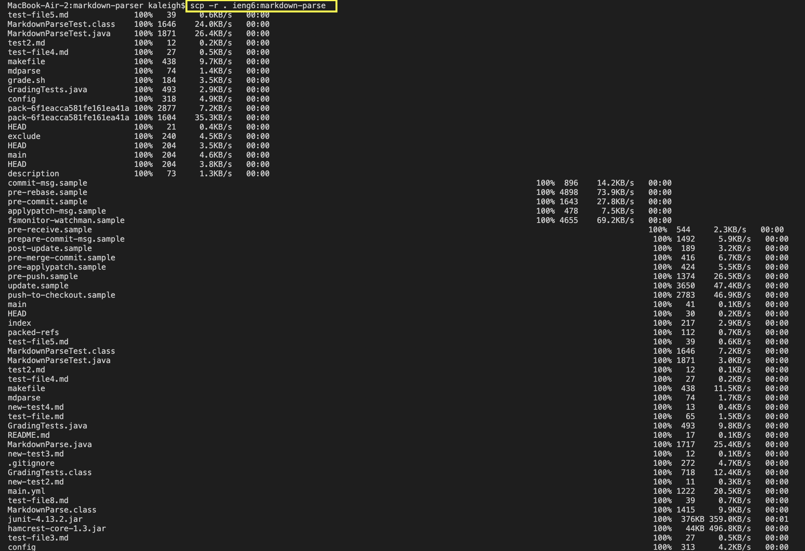

Since markdown-parser is now copied into my `ieng6`, now I should be able to compile and run my tests file, `MarkdownParseTest.java`. Shown below is an image of me compiling and running my test file within my `ieng6` account, seeing that I have passed all of my test cases! :

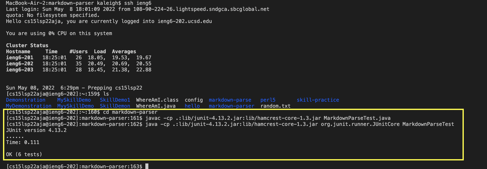

Below shows me using a one line command to log into my `ieng6`, copying `markdown-parse` into my `ieng6`, and compiling and running the tests within my `ieng6 account` using: 
```
scp -r . ieng6:~/markdown-parser; ssh ieng6 "cd markdown-parser; /software/CSE/oracle-java-17/jdk-17.0.1/bin/javac -cp .:lib/junit-4.13.2.jar:lib/hamcrest-core-1.3.jar MarkdownParseTest.java; /software/CSE/oracle-java-17/jdk-17.0.1/bin/java -cp .:lib/junit-4.13.2.jar:lib/hamcrest-core-1.3.jar org.junit.runner.JUnitCore MarkdownParseTest"
```
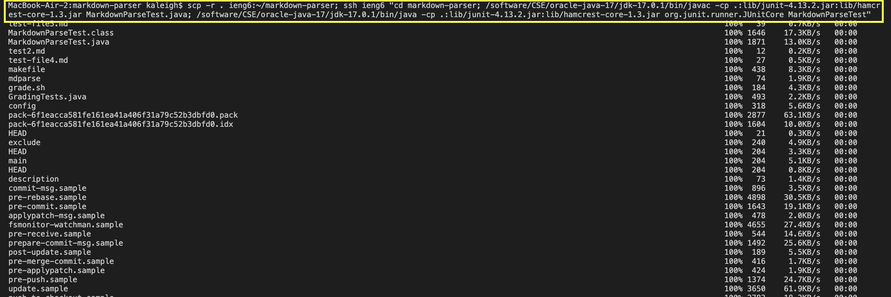
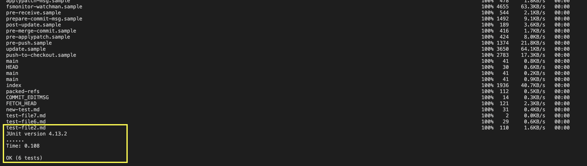