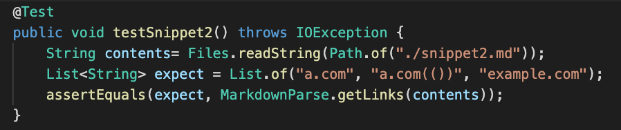
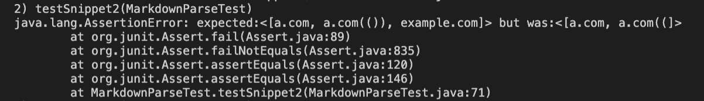
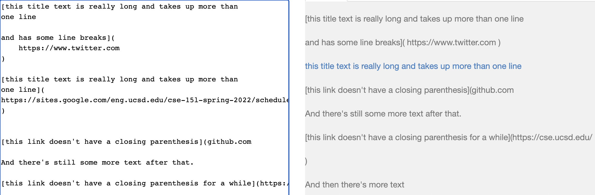

# Lab Report 4

```
By Kaleigh Ross Mogatas 
ID: A17051705
```
---
For this lab report, we will be working with three different snippets. We will be creating a total of six tests cases as we will be creating three on my groups test and three for the group we reviewed in week 7. We will run and show what the outcome was within each test for each snippet.

This is the [link](https://github.com/Sking56/markdown-parser) to my group's repository.

Now, this is the [link](https://github.com/mdsflyboy/markdown-parser) to the group we reviewed.

---

>## **Snippet 1** 

```
`[a link`](url.com)

[another link](`google.com)`

[`cod[e`](google.com)

[`code]`](ucsd.edu)
```

The expected output of `Snippet 1` should be `[google.com, google.com, ucsd.edu]`. As indicated by the [CommonMark demo site](https://spec.commonmark.org/dingus/):


This was the test code I had implemented within my grou's code as we wanted to test Snippet 1. This implements a JUnit test in order to see if our code worked or not.


Here, this is the JUnit test we used to check the group's code that we had reviewed:


> Result of running test for Snippet 1

After running the test for both implementations, my group and the group we reviewed, for Snippet 1, both test cases had failed. Both test cases failed becuase it had returned a different outcome than the expected result.

This was the error message my group's code got after running JUnit:

Our output was ``[url.com, `google.com, google.com]``.

This was the error message for the review group's code:

Their output was ``[url.com, `google.com, google.com, ucsd.edu]``.

> Review question for Snippet 1

I believe that there is a small code change that will make my program work for Snippet 1 that uses inline code with backticks. I feel like as long as we check the start and the end of the backticks. This is because then we would be able to ignore any open and closed parenthesis and brackets inside those backticks, which will hopefully make our code run properly.

---
>## **Snippet 2** 

```
[a [nested link](a.com)](b.com)

[a nested parenthesized url](a.com(()))

[some escaped \[ brackets \]](example.com)
```

The expected output of `Snippet 2` should be `[a.com, a.com, example.com]`. As indicated by the [CommonMark demo site](https://spec.commonmark.org/dingus/):


This is my group's JUnit test implementation in order to check if our code would pass or fail, by if it returned the correct output.


Here, this is the JUnit test we used to check the group's code that we had reviewed:


> Result of running test for Snippet 2

After running the JUnit tests for both groups. Both group's had failed the test because the outputs did not match the expected outputs.

This was my group's error message when running the JUnit test.

Our output was `[a.com, a.com((]`.

This was the error message when running the test for my review group's code.

Their output was `[a.com, a.com((, example.com]`.

> Review question for Snippet 2

I believe that there is not a possible small code change that will make my program work for Snippet 2 that uses nested parentheses, brackets, and escaped brackets. I feel this because we would have to take into consideration all the necessary nested parenthesis and brackets. Above this checking, we have to see if this formatting is within the correct order, and if there are some afterwards and within the code, which can take a bit of lines.

>## **Snippet 3** 

```
[this title text is really long and takes up more than 
one line

and has some line breaks](
    https://www.twitter.com
)

[this title text is really long and takes up more than 
one line](
https://sites.google.com/eng.ucsd.edu/cse-15l-spring-2022/schedule
)


[this link doesn't have a closing parenthesis](github.com

And there's still some more text after that.

[this link doesn't have a closing parenthesis for a while](https://cse.ucsd.edu/


)

And then there's more text
```

The expected output of `Snippet 3` should be `[https://sites.google.com/eng.ucsd.edu/cse-15l-spring-2022/schedule]`. As indicated by the [CommonMark demo site](https://spec.commonmark.org/dingus/):



This is my group's JUnit test that I implemented to see if our code functioned properly.


Here, this is the JUnit test we used to check the group's code that we had reviewed:


> Result of running test for Snippet 3

After running the JUnit test cases that we had implemented between the two groups. The test cases for both groups had failed. They both failed because the resulting output of both of our groups did not match the expected output.

This is my group's error message once running JUnit.

Our output was:
```
[
    https://www.twitter.com
, 
https://sites.google.com/eng.ucsd.edu/cse-15l-spring-2022/schedule
, github.com

And there's still some more text after that.

[this link doesn't have a closing parenthesis for a while](https://cse.ucsd.edu/


]
```

This was the review group's error message when running JUnit.

Their output was `[]`.

> Review question for Snippet 3

I believe that there is not a possible small code change that will make my program work for Snippet 3 that uses newlines in brackets and parentheses. I believe that it will take a longer code to fix the error because we would have to account for all the additional new lines being placed within the parenthesis and brackets. From this we would have to keep track of where the links and phrases continue and start at because of the newlines messing up the formatting of the link creation.