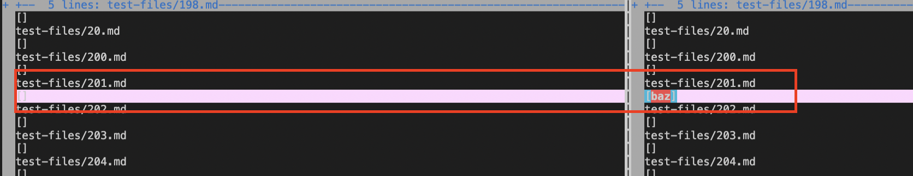
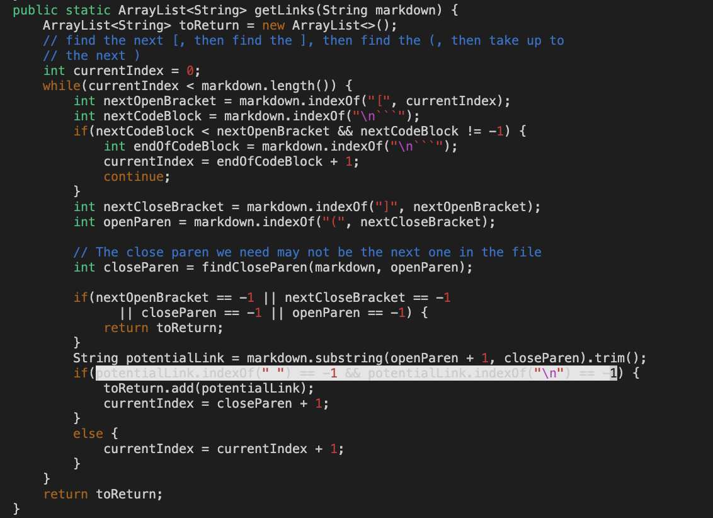

# Lab Report 5

```
By Kaleigh Mogatas 
ID: A17051705
```

The two test cases that I selected to review for this lab report would be test cases 201 and 483.

>## **Explanation of how I found the tests with different results** 


The way that I found the tests with different results was that I created a `results.txt` for both `my-markdown-parser/` and `cse15lsp22-markdown-parser/` by using `bash script.sh > results.txt` on both directories. From this I used 

```vimdiff my-markdown-parser/results.txt cse15lsp22-markdown-parser/results.txt``` 

which resulted in the following image that compares the two `results.txt` files and outlining which ones resulted in different outcomes:


Basically, I used `vimdiff` on the two different `results.txt` files.

>## Test one: 201.md


The left side is my implementation, while the right side is the staff's implementation.

Link to `201.md` test: 

[https://github.com/nidhidhamnani/markdown-parser/blob/main/test-files/201.md?plain=1](https://github.com/nidhidhamnani/markdown-parser/blob/main/test-files/201.md?plain=1)

The image below is the expected outcome for `201.md`:


So, this shows that the expected outcome should be `[]`.

When running `MarkdownParse` on my implementation for `201.md` this was my outcome:


When running `MarkdownParse` on the provided implementation for `201.md`, this was their outcome:


When we look at the outcome provided by [the CommonMark demo site](https://www.google.com/url?q=https://spec.commonmark.org/dingus/&sa=D&source=docs&ust=1654128530256954&usg=AOvVaw1WuO-AK8uVKgBH-J4gMpf6), my implementation for `201.md` is correct, while the provided implementation from the staff is incorrect.

This is because the expected outcome should be `[]`, which is what my implementation got. However, the staff's implementation was `[baz]`.

>Describing bug for `201.md`



The bug within this code is that it does not take into account if the close bracket `]` and open parenthesis `(` is next to each other. It only checks if `[]` and `()` are present within the line of code. Since there are additional words and spaces between the `]` and `(` this should not make a link. In order to fix the code, it should check if the indexes of `]` is exactly before the index of `(` before adding the link to the list.

>## Test two: 483.md


The left side is my implementation, while the right side is the staff's implementation.

Link to `483.md` test: 

[https://github.com/nidhidhamnani/markdown-parser/blob/main/test-files/483.md?plain=1](https://github.com/nidhidhamnani/markdown-parser/blob/main/test-files/483.md?plain=1)

The image below is the expected outcome for the `483.md`


So, this shows that the expected outcome should be `[]` since a link does not pop up within the preview.

When running `MarkdownParse` on my implementation for `201.md` this was my outcome:


When running `MarkdownParse` on the provided implementation for `201.md`, this was their outcome:


When we look at the outcome provided by [the CommonMark demo site](https://www.google.com/url?q=https://spec.commonmark.org/dingus/&sa=D&source=docs&ust=1654128530256954&usg=AOvVaw1WuO-AK8uVKgBH-J4gMpf6), my implementation for `483.md` is correct, while the provided implementation from the staff is incorrect.

This is because the expected outcome should be `[]`, which is what my implementation got. However, the staff's implementation was `[./target.md]`, which is incorrect.

>Describing bug for `483.md`


The bug within this code is that it does not check if there is text in between the `[]` in order to see if it actually creates an accessible link. It just checks if brackets exist within the line of code. In order to fix the code, it should make sure that the indexes of open bracket `[` and close bracket `]` is not directly next to each other. Additionally, it should check if there is actually text in between the `[]` in order to actually be able to add the link to the list.